# tech201_agile_and_scrum
Notes on Agile and scrum 27.01.23
## Contents
What Is Agile And How Does It Fit Into DevOps

Agile Values And Benefits 

How Does Agile Benefit A Business 

What Is The Difference Between Agile And Traditional Models 

What Is Scrum And Its Benefits 

What Is The Difference Between Agile And Scrum 

What Are The Artifacts 

What Are The Three Pillars Of Scrum 

Scrum Team And Scrum Roles

How Can We Effectively Gather Requirements 

DOR And DOD What Is The Difference 

What Are The Three Amigos And Three C's Of Scrum 

Summary

## What Is Agile And How Does It Fit Into DevOps
- Maintain productivity 
- Improve teamwork flow
- Documentation
- Makes process of deployment smoother
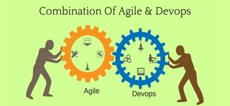

## Agile Values And Benefits 
- Individuals and Interactions over processes and tools, projects are built around motivated individuals with the support they need.​
- Working software over comprehensive documentation, documentation when necessary.​
- Customer collaboration over contract negotiation, explicit value is delivered to customers over every sprint.​
- Responding to change over following a plan, The key is continual planning throughout the project
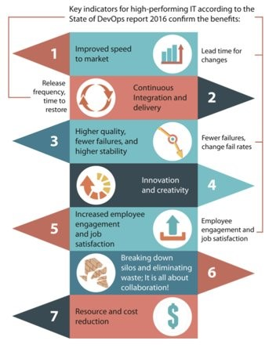
## How Does Agile Benefit A Business 
- Improved product quality
- Increased business value
- Increased customer satisfaction
- Increased adaptability
- Increased alignment 
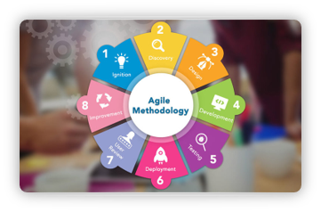

## What Is The Difference Between Agile And Traditional Models 
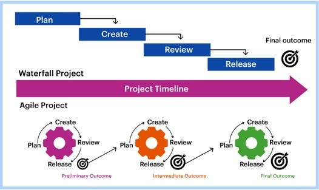

## What Is Scrum And Its Benefits 
- Framework For Project Management

## What Is The Difference Between Agile And Scrum 
- Scrum is a methodology, while Agile is a philosophy​
- Scrum provides an implementation framework, while Agile does not​
- Scrum describes three key roles, while Agile emphasizes self-organizing teams​
- Scrum has five living values, while Agile has four fundamental tenants​
- Scrum has three pillars, while Agile has 12 principles
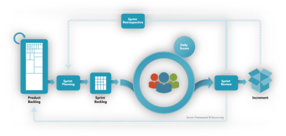
## What Are The Artifacts 
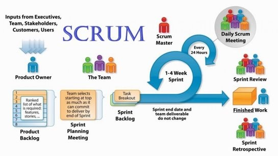
## What Are The Three Pillars Of Scrum 
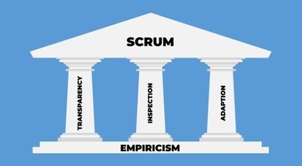
## Scrum Team And Scrum Roles
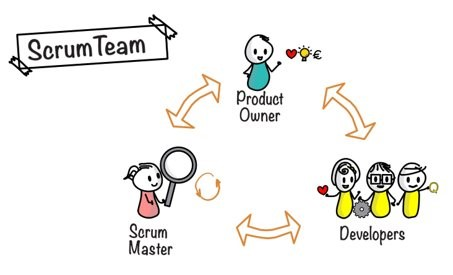
## How Can We Effectively Gather Requirements 
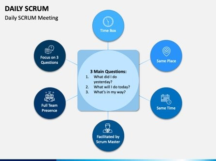
## DOR And DOD What Is The Difference 
- DOR stands for definition of ready whereas DOD stands for definition of done​
- A ready backlog item needs to be clear , feasible and testable​
- A done item must meet the agreed upon acceptance criteria the Product Owner 
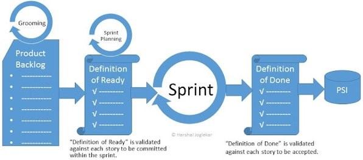
## What Are The Three Amigos And Three C's Of Scrum 
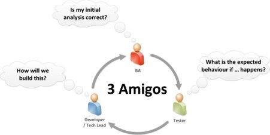
## Summary
- Implementing Scrum methodology while keeping in mind the principles of Agile results in numerous benefits to businesses ​
- The benefits of Scrum and Agile include team satisfaction, productivity, quality, transparency and customer satisfaction​
- Products can be released more quickly without compromising quality