# tech201_agile_and_scrum
Notes on Agile and scrum 27.01.23
## Contents
1. What Is Agile And How Does It Fit Into DevOps

2. Agile Values And Benefits 

3. How Does Agile Benefit A Business 

4. What Is The Difference Between Agile And Traditional Models 

5. What Is Scrum And Its Benefits 

6. What Is The Difference Between Agile And Scrum 

7. What Are The Artifacts 

8. What Are The Three Pillars Of Scrum 

9. Scrum Team And Scrum Roles

10. How Can We Effectively Gather Requirements 

11. DOR And DOD What Is The Difference 

12. What Are The Three Amigos And Three C's Of Scrum 

13. Summary

## What Is Agile And How Does It Fit Into DevOps
- Maintain productivity 
- Improve teamwork flow
- Documentation
- Makes process of deployment smoother

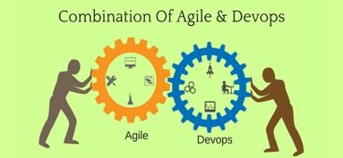

## Agile Values And Benefits 
- Individuals and Interactions over processes and tools, projects are built around motivated individuals with the support they need.​
- Working software over comprehensive documentation, documentation when necessary.​
- Customer collaboration over contract negotiation, explicit value is delivered to customers over every sprint.​
- Responding to change over following a plan, The key is continual planning throughout the project

### The 12 principles of Agile
- Our highest priority is to satisfy the custome, through early and continuous delivery of valuable software.
- Welcome changeing requirements, even late in development. Agile processes harness change for he customers competitive advantage.
- Deliver Working software frequently from a couple of weeks to a couple of months, with a preference to the shorter timescale.
- Business people and developers must work together daily throughout the project.
- Build projects around motivated individuals. Give them the environment and support they need, and trust them to get the job done.
- The most efficient and effective method of conveying information to and within a development team is face to face conversation.
- Working software is the primary measure of progress.
- Agile processes promote sustainable development. The sponsors, developers, and users should be able to maintain a constant pace 
indefinately.
- Continuous attention to technical excellence and good design enhances agility.
- Simplicity--the art of maximizing the amount of work not done--is essential.
- The best architectures, requirements, and designs emerge from self organising teams.
- At regular intervals, the team reflects on how to become more effective, then tunes and adjusts is behaviour accordingly.
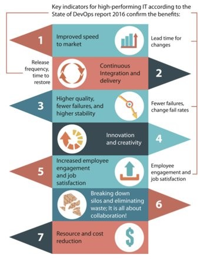
## How Does Agile Benefit A Business 
- Improved product quality
- Increased business value
- Increased customer satisfaction
- Increased adaptability
- Increased alignment

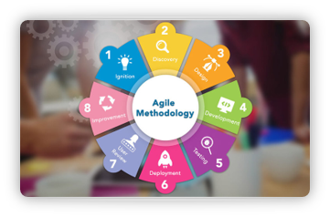

## What Is The Difference Between Agile And Traditional Models 
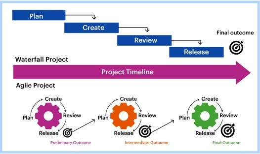

## What Is Scrum And Its Benefits 
- Framework For Project Management

## What Is The Difference Between Agile And Scrum 
- Scrum is a methodology, while Agile is a philosophy​
- Scrum provides an implementation framework, while Agile does not​
- Scrum describes three key roles, while Agile emphasizes self-organizing teams​
- Scrum has five living values, while Agile has four fundamental tenants​
- Scrum has three pillars, while Agile has 12 principles
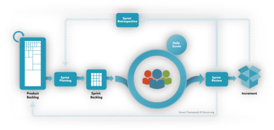
- 
## What Are The Artifacts 
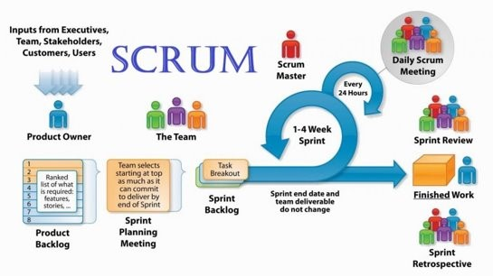

## What Are The Three Pillars Of Scrum 
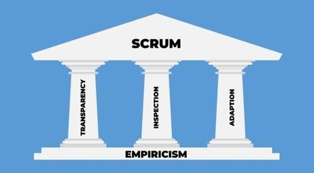

## Scrum Team And Scrum Roles
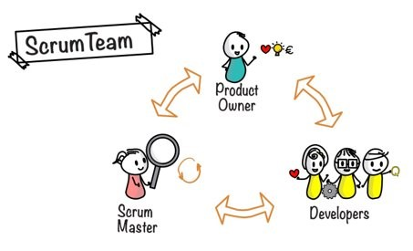

## How Can We Effectively Gather Requirements 
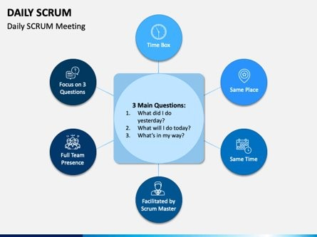

## DOR And DOD What Is The Difference 
- DOR stands for definition of ready whereas DOD stands for definition of done​
- A ready backlog item needs to be clear , feasible and testable​
- A done item must meet the agreed upon acceptance criteria the Product Owner 
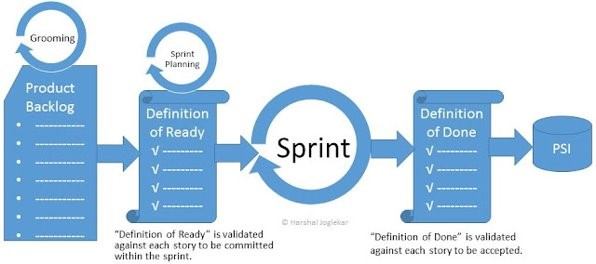
- 
## What Are The Three Amigos And Three C's Of Scrum 
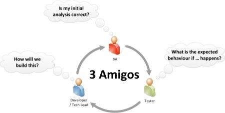

## Summary
- Implementing Scrum methodology while keeping in mind the principles of Agile results in numerous benefits to businesses ​
- The benefits of Scrum and Agile include team satisfaction, productivity, quality, transparency and customer satisfaction​
- Products can be released more quickly without compromising quality